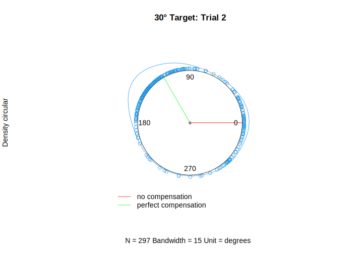
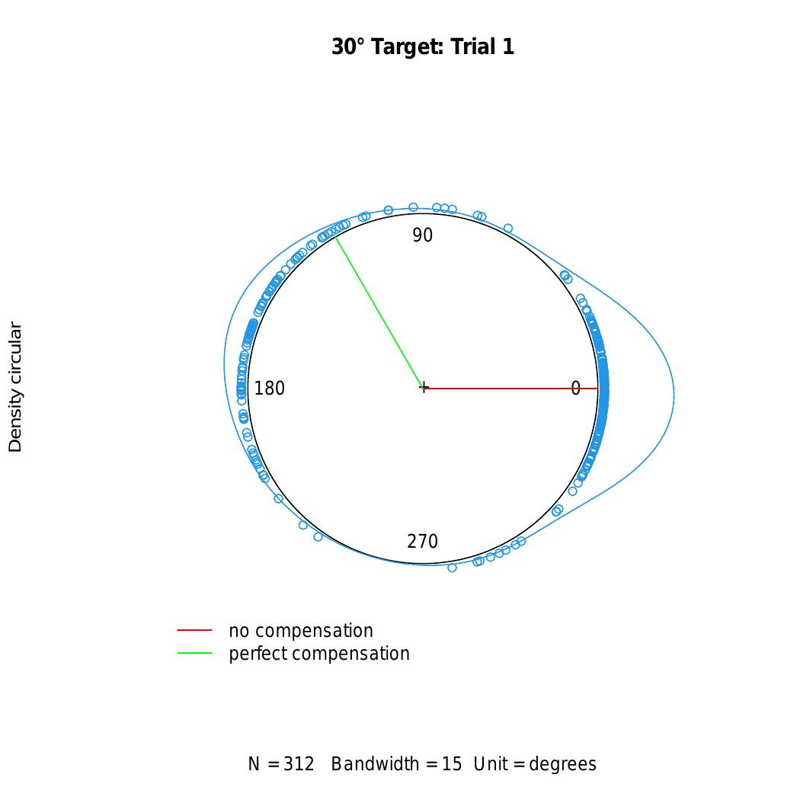
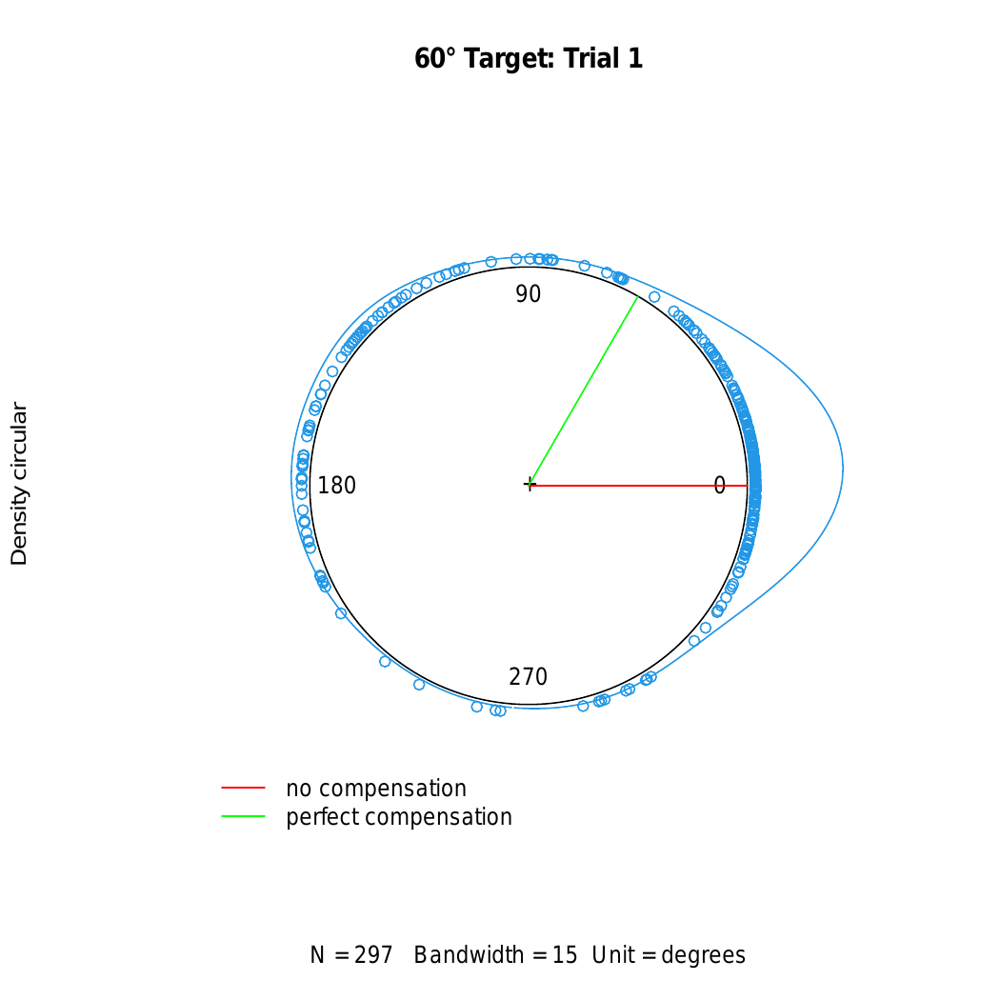
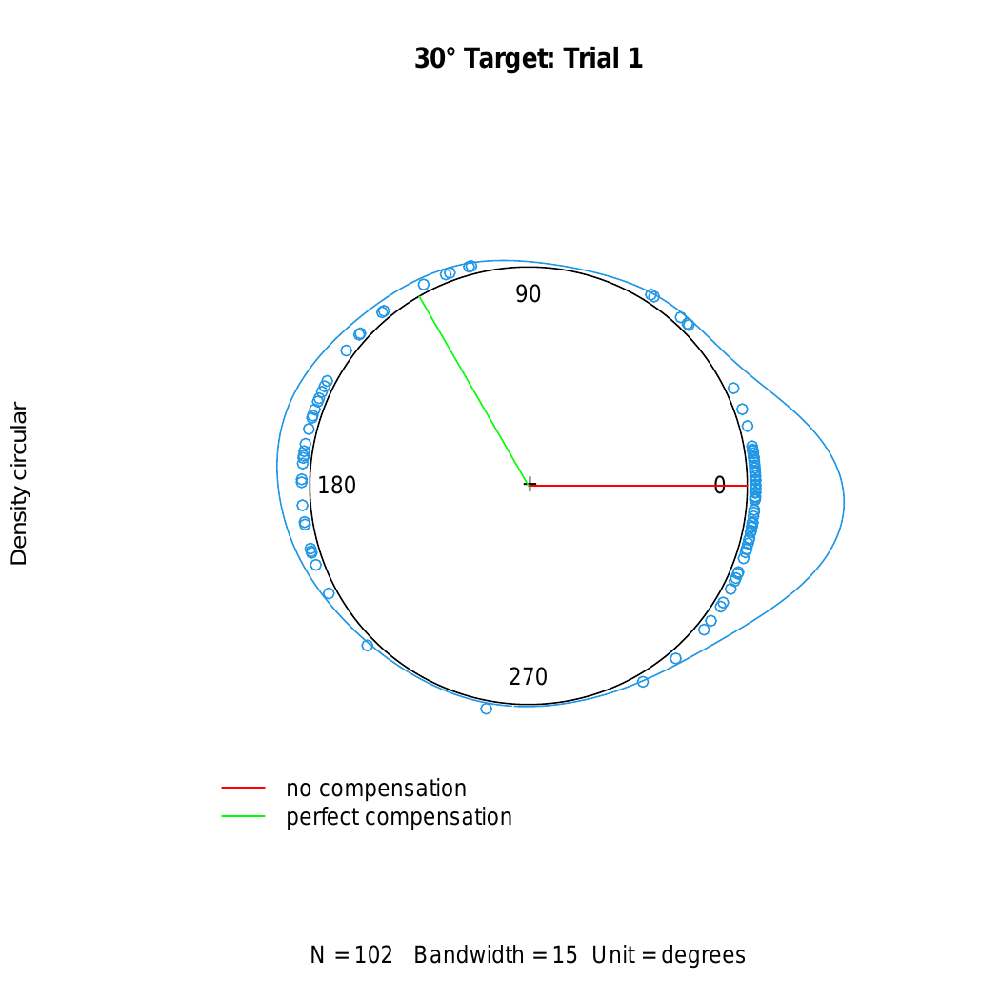
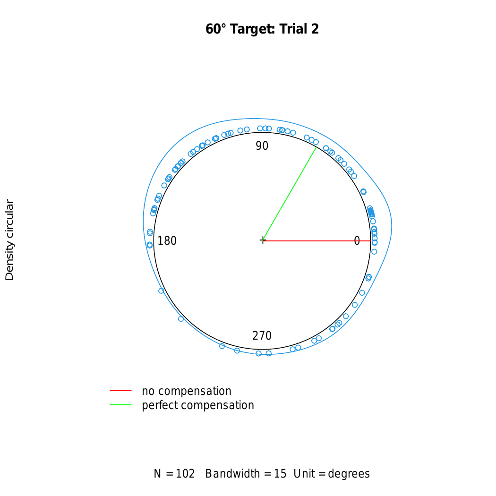

# Overview

This document contains analyses for the first versions of the browser-based mirror reversal experiment we conducted. The experiment we discuss in the manuscript is the updated version that we made to address the different issues we encountered with the versions discussed here.

Participants reached to two targets (30 and 60 degrees in polar coordinates) using their computer mouse or trackpad. There were two groups, an instructed and non-instructed group. The instructed group were told about the nature of the perturbation (i.e. cursor is in the opposite direction of the hand/mouse, flipped along the y-axis), while the non-instructed group were simply told that the cursor would be moving differently and they needed to compensate for it.

# Set up the R enviornment

We have written code that pre-processes the data, plots figures, and runs statistical tests. Import the sources below:

```{r message=FALSE, warning=FALSE}
source('ana/shared.R')
source('ana/su&fa2020online.R')
source('ana/qualtricsdata.R')
source('ana/mironline_fa2020.R')
source('ana/mirgeneralization_fa2020.R')
```

# Data sets

There are three data sets associated with these analyses.
1) mReversalNewALpha3-master (Summer 2020): This includes the instructed participants.
2) mirrorreversal-fall (Fall 2020): This includes the non-instructed participants.
3) mirrorgeneralization-master (Winter 2021): This includes non-instructed participants that returned to complete the second session.

## Cleaning the data

Some participants or data files had to be removed due to different issues, including:
1) incomplete or duplicate data, mismatch in IDs, technical problems
2) no corresponding Qualtrics data
3) did not use a mouse or trackpad
4) did not approve consent form but did the task
5) indicated neurological disease
6) cleaned baseline (aligned) reaches

For baseline reaches, some participants were reaching in different directions, even though the task required that they reach towards targets in the upper-right quadrant of the workspace. Here, we only included trials that fell within this quadrant for the aligned session. If a participant was left with less than half the data for each target location (i.e. less than 5 trials), they were removed from further analyses.

This led to N = 102 for the instructed group, N = 609 for the non-instructed group, and N = 364 participants completed the generalization experiment.

## Experiment Schedule

The experiment had 20 trials of aligned cursor feedback, followed by 90 mirror reversed trials, then 20 washout trials with aligned cursor feedback. Although both data sets follow the schedule of aligned - mirror reversal - washout blocks, the data sets were collected at different points during the development of the experiment. In the Summer 2020 or instructed participants data set, all participants started with the 30 degree target and following trials alternated with the other target location. In other words, all odd trials will contain the 30 degree target location, and even trials will contain the 60 degree target location. In the Fall 2020 or non-instructed participants data set, we implemented a randomization of the target location presented. Therefore, around half of participants started with the 30 degree target, while the other half started with the 60 degree target. The target locations presented in the next trials after were randomized, but each participant made an equal amount of reaches to each target.

## Dealing with circular data points

Reach data are pre-processed to have target locations aligned to zero. Thus, the magnitude of a given value compared to zero would indicate the angular reach deviation, and the sign of this value would indicate the direction with respect to target. Due to the nature of the mirror reversal, participants make reaches in highly variable directions. This means that they can have angular reach deviations of 180 degrees and -180 degrees. Treating these values as linear makes it seem as if these values are in two different opposite locations, which is not the case. This is why we transformed that data to be circular (i.e., both values would be at 180 degrees in a circle). The advantage of transforming the data to circular numbers is evident when calculating the mean values for angular reach deviations across trials. Consider the example below:

```{r}
numdat <- c(-175, -170, -165, 165, 170, 175)
circdat <- as.circular(numdat, type='angles', units='degrees', template = 'none', modulo = 'asis', zero = 0, rotation = 'counter')
plot(numdat)
plot(circdat)
mean(numdat)
mean.circular(circdat)
```

Here, we see that the mean for the data when treated as numeric is at 0 degrees, while the mean for the circular data is at 180 degrees. Importantly, all learning curve figures within our analyses use circular data. That is, the reach deviations are transformed into circular numbers, then 95% bootstrapped confidence intervals are calculated based on the mean of this circular data. These values are then just transformed back to a numeric type, in order to plot them on a 2-dimensional figure (i.e. plot with x and y axes). (For more information see code for function: getCircularConfidenceInterval in shared.R)

### Discrepancy between 2-D and circular plot?

```{r}
plotCircularAllTasks(set='fa2020')
```



Let's consider the Fall 2020 (non-instructed) data set. We observe with the learning curve plot that by the second trial, participants are already at perfect compensation (120 degrees) for the 30 degree target, then this dips down to around 90 degrees. However, when we look at the circular plot for trial 2, the peak of the density distribution (blue curve around plot) is at a higher value than perfect compensation. It is important to note that the peak of this density is not equivalent to the mean, given that the values are distributed all around. While the mean values for every trial are equivalent to those shown in the 2-D plot, the density distribution peaks are higher at a different value than the mean depending on how many participants have reaches within a particular location. In other words, the peak is representing the mode of the distribution. Note, however, that the peak may not always be the mode, as different locations can have the same frequency values (multiple modes).

### Individual distributions on a 2-D plot

Next, we can investigate the mean values observed in our learning curve figures by simply showing angular reach deviations from every participant, across all trials. We show such a plot for every target location for the two data sets (non-instructed, followed by instructed).

```{r, fig.width = 20, fig.height = 12}
plotIndividualAllTasks(set='fa2020')
plotIndividualAllTasks(set='su2020')
```

Note for these plots that 180 and -180 are the same locations in space. We observe a variable distribution of reach deviations during the mirror reversed trials. For example, with the non-instructed set, there seems to be a bimodal distribution for the 30 degree target, where we see deviations around perfect compensation and some closer to zero. The red line indicates the circular mean, which is equivalent to values we observe from the learning curve figures. The orange line is what the mean would be, based on just the numerical values of the dots. The circular mean is a better representation, but is clearly being biased by the bimodal distribution.

The circular men seems to be higher for the first few mirror reversed trials. It seems to be pulled by having more deviations in the negative direction (equal to or even more negative than -180). Again, given that these are similar locations to + 180 degrees, it would make sense that the mean would be where it is. However, deviations in this direction diminish in later trials, thereby losing the effect it had on the mean during early trials. Thus, the mean in later trials is positioned in between the bimodal distribution. This may explain the "drift" that we observe with the learning curve for the 30 degree target in the non-instructed data set.

For washout trials, we also observe reaches that are not near zero. These likely just reflect participants with noisy data (i.e. reaching in various directions). Note that this is not seen in aligned trials because we deliberately considered only reach deviations that fell within the upper-right quadrant of the workspace (see baseline cleaning procedure). However, majority of the responses and the mean values are still around zero, indicating the absence of reach aftereffects.

Interestingly, it seems like the bimodal distribution is more evident with the 30 degree target, compared to the 60 degree target. Moreover, we observe a larger "drift" in learning for the 30 degree target. Learning could be dependent on target location then, or how far the target is from the mirror axis. Such a target effect is one of our motivating reasons to explore the different target locations in the manuscript.

### Heatmaps for each target location

We can also generate heatmaps of these angular reach deviations for each group and target location. For these heatmaps, angles are binned into 10 degrees between -200 to 200 deg. Then each participant's reach deviation for each trial is categorized into these bins. Reach deviations within each bin are then summed to calculate a count/frequency for that bin in each trial. Finally, a heatmap is generated to show the frequency of reach deviations across trials.

#### Non-instructed group
```{r, fig.width = 20, fig.height = 12}
plotHeatmaps(set='fa2020')
```

#### Instructed group
```{r, fig.width = 20, fig.height = 12}
plotHeatmaps(set='su2020')
```

For both groups, we see that bins with the highest frequency are near zero for aligned and washout trials, and centred near perfect compensation for mirrored trials. Frequencies are more variable for the 60 degree target location, compared to the 30 degree location.

### Alternative to generating Confidence Intervals for circular data points

While we analyzed the Summer 2020 (instructed participants) data using the transformation to circular data points as we discussed above, we realized from the online experiment (i.e. experiment in manuscript, see Analyses_MirRevAdapt.Rmd) that targets far from the mirror axis also present the problem of showing wide confidence intervals (CIs). That is, since perfect compensation for the far target is at 170 degrees (close to 180 degrees), the circular data points will either be in the positive or negative direction. Thus, the CIs generated on a 2-D plot will span the full range from -180 degrees to +180 degrees. 

To fix this, we first took the circular data points and converted them from degrees to radians. We then calculated a sum of sin and sum of cos of these values in radians, before converting back to degrees using the function atan2. We bootstrap these values with replacement (1000 resamples), such that we are able to generate lower, middle, and upper values to generate CIs. Then to deal for problems with the far target, we add 360 degrees for bootstrapped values below -90 degrees (i.e. angles of -90 to -180) for only the far group. This allowed us to generate more accurate CIs as we show in the manuscript plots. We note that this method of generating bootstrapped angular reach deviations (see getAngularReachDevsCI function in shared.R) do not produce qualitatively different means, just slightly more accurate estimates since it was bootstrapped. The difference is mainly adjusting CIs for the far target, which neither the Summer 2020 (instructed) or Fall 2020 (non-instructed) data have. Regardless, since bootstrapped estimates are more accurate, we use this function to generate plots for the Fall 2020/ non-instructed participants. Below is an example that plots the Fall 2020 data using both methods of generating CIs. We observe no differences between methods for plotting the learning curves.

```{r}
plotCircularAllTasks(set='fa2020')
plotMirOnlineAllTasks()
```

# Learning rates and aftereffects

The plots below show angular reach deviations across all experimental blocks for each group, according to target location. Solid lines are means and shaded regions are 95% confidence intervals. Reaching directly towards the target would correspond to zero degrees. Perfect compensation for the 30 degree target would be deviating the mouse position by 120 degrees, while the 60 degree target would require a 60 degree deviation.

Non - instructed group:

```{r}
plotMirOnlineAllTasks()
```

Instructed group:

```{r}
plotCircularAllTasks(set='su2020')
```

There seems to be a difference between target locations during the aligned session, although this difference is likely due to reach biases in relation to each target location. Note that without the baseline cleaning procedure we implemented, these lines during baseline are overlapping. Regardless, reaches during the aligned session are near the zero degree mark.

Learning progresses quickly for both groups. Participants reach near perfect compensation for the 60 degree target. Reaches for the 30 degree target are deviated, but not quite near perfect compensation. 

No reach aftereffects are observed for either group. Given that de novo learning establishes a new response mapping within the brain, we expect an absence of reach aftereffects, unlike in adaptation, to support the idea that participants switch between response mappings with the mirror reversal task.

For the instructed group, we were only interested in seeing the effect of instructions on their performance in the initial trials. Instructions did not seem to provide an advantage for dealing with the mirror reversal. If there was an effect of instructions, we would expect to see reaches for the first trial deviated towards the correct direction. However, the mean of the reaches for the 30 degree target during the first trial in the instructed group are near the zero degree mark. As this is a browser-based study, instructions were only printed on the screen before participants started the mirror reversed trials. The lack of an effect of instructions could be that some participants did not fully understand the nature of the perturbation and the strategy to counter for it. 

Hence, we present statistical analyses for the non-instructed participants only. We test for target or block effects for each of the trial types. The two targets are either the 30 degree or 60 degree location. In the aligned session blocks are defined as the first three trials, second three trials, and last three trials of aligned reaches. We conduct a 3x2 within-subjects design (block x target) ANOVA.

```{r}
alignedMirOnlineANOVA()
```
We find a main effect of target, which is seen with the aligned reaches on the plot. Next, we conduct a 3x3 (block x target) within-subjects ANOVA for the mirror reversed trials. For blocks, these were defined as the first three, second three, and last 15 trials of training. We also transformed the angular reach deviations to percentages of compensation, to make the two targets comparable.

```{r}
mirOnlineANOVA()
```

We find main effects of target and block. From the plot, we see that the target effect is driven by near perfect compensation for the 60 degree location, but less compensation for the 30 degree location. 

```{r}
MirOnlineComparisonsEffSize()
```

Follow-up tests on the block effect show that the first block had the lowest compensation percentages. We then see an increase in compensation in the second block, before going down for the last block. Then, we run the same 3x2 (block x target) within-subjects ANOVA for the washout trials. The blocks are defined similar to how they were defined for the aligned trials.

```{r}
RAEMirOnlineANOVA()
```

We find a main effect of target, which is observed from the plot. Angular reach deviations were lower for the 30 degree location. Finally, we can compare the washout trials with the aligned reaches, to test for reach aftereffects. We conduct a 2x2 (target x block) within-subjects ANOVA.

```{r}
RAEBaselineANOVA()
```

There is no main effect of session, but we find a session x target interaction.

```{r}
RAEBaselineComparisonsEffSize()
```

Follow-up tests show that this is due to the difference in the 60 degree target from aligned to washout trials. Nevertheless, reaches in washout trials are near zero, suggesting the absence of reach aftereffects.

Importantly, we observe that the reaches are already deviated during the first trial of mirror reversed reaches. Hence, we investigate this further.

# Reach distributions and workspace exploration

To get a complete picture of how participants are performing, we can plot the distribution of angular reach deviations of all participants within each group. The plots below will show a circular density distribution, where zero degrees (red line) corresponds to no compensation (i.e. hand/mouse goes directly to target location), and perfect compensation is marked with a green line depending on the target location. The animated plots also show how the distribution of responses changes across the 90 trials of mirror reversed training.

## Non - instructed group





For both targets, we see a somewhat bimodal distribution in trial 1. We also see a general shift of responses towards the correct reach direction almost immediately in the following trials (i.e. highest peak in distribution moves towards perfect compensation location for each target).

### Move throughs or exploration

To investigate why we get a subset of participants already reaching in the correct direction relative to the mirror axis by trial 1, our hypothesis is that participants are making exploratory movements. That is, before the first mirror reversed trial begins, participants had to bring the cursor to the start position at the centre of the screen. However, during this time, the mirror reversal has already been implemented, which would have led to participants knowing which approximate direction they should reach, in order to successfully complete the upcoming trial. 

These exploratory movements may be measured with what we will call as a move through. A given trial is divided into 3 steps. Step 1 would be bringing the cursor to the start position, step 2 will be the target appearance and reach towards its location, and step 3 would be the return movement to the start position. A participant needs to stay at the start position in order for step 1 to change to step 2. However, a move through would occur when participants do not hold at the start position, thereby making the current trial stay at step 1. This allows them to explore the mirror reversed relationship of the cursor with their movements. In the experiment, an ideal trial will collect two samples at step 1, before switching to step 2. Therefore, participants with trials that have 3 or more samples at step 1 are considered as those that committed a move through. Below are the frequencies of participants with move throughs for each target location, across the 90 mirror reversed trials.

```{r}
plotParticipantMoveThrough(set='fa2020')
```

We see that move throughs are very much persistent on trial 1. Therefore, we can plot the circular density distributions for trial 1 while separating participants into subgroups of those with or without move throughs (i.e., those that did and did not explore the workspace).

```{r, fig.height=7}
plotTrialOneCheckGroupCircFreq(set='fa2020')
```

For both target locations, participants that explored the workspace are more likely to have reach deviations in the correct side of the mirror, while the non-explorers reach directly towards the target. Thus, we can plot the learning curves for each target location, while separating participants into these two subgroups.

```{r}
plotMoveThroughAllTasks(set='fa2020')
```

The plots show that the already deviated reaches by trial one that was shown earlier was a reflection of how the mean was being pulled away from the zero degree mark by those participants that explored the workspace. Otherwise, participants that did not explore the workspace are reaching directly towards the target during trial one. Regardless, participants learn quickly that they should be reaching in the opposite direction.

### Movement Time

As further evidence for the exploratory behavior, we can also investigate whether there is a relationship between movement time during step 1 (holding at home position), and the corresponding angular reach deviation that was produced for that trial. If there is, then it would support the hypothesis that exploratory behavior is linked to knowing where to reach during the trial.

```{r}
plotGroupRDMT(group='30', set='fa2020')
plotGroupRDMTOutlierRemoved(group='30', set='fa2020')
```

For the 30 degree target, we find a significant relationship between step 1 movement time and the corresponding reach deviation for that trial. The relationship holds after removing 14 outlier participants for this analysis. Outliers are considered as participants with movement times that are +/- 2 SD from the mean.

```{r}
plotGroupRDMT(group='60', set='fa2020')
plotGroupRDMTOutlierRemoved(group='60', set='fa2020')
```

For the 60 degree target, we find the same results. Here, 14 outlier participants were removed.

When we separate participants into the two subgroups of explorers and non-explorers, the relationship is not statistically significant. However, we find a clear distinction in the plots below that explorers have longer step 1 movement times, and have more reach deviations near full compensation.

```{r}
plotMoveThroughGroupRDMT(group='30', set='fa2020')
plotMoveThroughGroupRDMT(group='60', set='fa2020')
```

Similar results are obtained even if we run the regression on the data with outliers removed.

```{r}
plotMoveThroughGroupRDMTOutlierRemoved(group='30', set='fa2020')
plotMoveThroughGroupRDMTOutlierRemoved(group='60', set='fa2020')
```

In addition to these, we can also show completion times during the reach to the target for all trials in the experiment.

```{r}
plotAllTasksMT(set='fa2020')
```

We find that movement times are initially longer during the first few trials of the mirror reversal, but eventually get close (but not similar) to baseline levels.

We conduct the same statistical tests as we did for reaching performance, but now use completion time for the dependent variable. We conduct a 3x2 (block x target) within-subjects ANOVA for aligned trials.

```{r}
alignedMTMirOnlineANOVA()
```

We find a main effect of block, but no interaction.

```{r}
alignedMTMirOnlineComparisonsEffSizeBlockEffect()
```

Follow-up tests show that participants made faster movements as the aligned trials proceeded. We then conduct the same test for mirror reversed trials.

```{r}
mirrorMTMirOnlineANOVA()
```

We find a target x block interaction. 

```{r}
mirrorMTMirOnlineComparisonsEffSize()
```

Follow-up tests show that movements were overall faster for the 30 degree location. Finally, we test washout trials.

```{r}
RAEMTMirOnlineANOVA()
```

We find a main effect of block.

```{r}
RAEMTMirOnlineComparisonsEffSizeBlockEffect()
```

We find faster movements during the last block compared to the first two blocks of washout trials.

### Path Length

Similar to the movement time analysis, path length is another variable that can support our findings regarding exploratory behavior. Path length is essentially the path/trajectory that participants take from one point to another. For example, shorter path lengths suggest straight and smooth movements to the target. Note, however, that a participant may show longer MTs while showing short path lengths. This would just mean that they stopped in their movement.

```{r}
plotGroupRDPL(group='30', set='fa2020')
plotGroupRDPLOutlierRemoved(group='30', set='fa2020')
```

For the 30 degree target, we do not find a significant relationship between step 1 path length and the corresponding reach deviation for that trial. However, this changes to a significant relationship after removing outliers (6 participants) from this analysis.

```{r}
plotGroupRDPL(group='60', set='fa2020')
plotGroupRDPLOutlierRemoved(group='60', set='fa2020')
```

We find the same pattern of results for the 60 degree target. The relationship is only significant after removing outliers (5 participants).

When we separate participants into the two subgroups of explorers and non-explorers, the relationship is not statistically significant. However, we find a clear distinction in the plots below that explorers have longer step 1 path lengths, and have more reach deviations near full compensation.

```{r}
plotMoveThroughGroupRDPL(group='30', set='fa2020')
plotMoveThroughGroupRDPL(group='60', set='fa2020')
```

After outlier removal, the relationship for participants with move throughs in the 60 degree location now becomes significant.

```{r}
plotMoveThroughGroupRDPLOutlierRemoved(group='30', set='fa2020')
plotMoveThroughGroupRDPLOutlierRemoved(group='60', set='fa2020')
```

In addition to these, we can also show path lengths during the reach to the target for all trials in the experiment. Note that path length is scaled to participants' monitor dimensions. That is, the start position to target distance is 40% (or 0.4) of the participant's monitor height. Here, baseline reaches are around this length.

```{r}
plotAllTasksPathLength(set='fa2020')
```

We find that path lengths are initially longer during the first few trials of the mirror reversal, but eventually get close to baseline levels.

We conduct the same statistical tests as we did for completion time, but use path length as the dependent variable. We start with aligned trials.

```{r}
alignedPLMirOnlineANOVA()
```

We do not find any effects. We then look into mirror reversed trials.

```{r}
mirrorPLMirOnlineANOVA()
```

We find main effects of target and block. For target, we observe in the plot that the 60 degree location had longer path lengths.

```{r}
mirrorPLMirOnlineComparisonsEffSizeBlockEffect()
```

Follow-up tests on the block effect show that path lengths keep getting shorter as the trials progressed. We then test washout trials.

```{r}
RAEPLMirOnlineANOVA()
```

We find a main effect of block.

```{r}
RAEPLMirOnlineComparisonsEffSizeBlockEffect()
```

Follow-up tests show that the first block differs from the second and last blocks, suggesting that path lengths were longer for the first block.

## Instructed group

The following analyses just repeat the ones in the previous section for the instructed group.





Trial 1 (only for 30 degree location) shows distributed responses. We also see an almost immediate general shift of responses towards the correct reach direction (i.e. highest peak of distribution moves towards perfect compensation location for each target).

### Move throughs or exploration

Below are the frequencies of participants with move through for each target location, across the 90 mirror reversed trials.

```{r}
plotParticipantMoveThrough(set='su2020')
```

We see that move throughs are only persistent on trial 1 for the 30 degree target, given that it is always the first trial for this group. Therefore, we can plot the circular density distribution for trial 1 of this target location, while separating participants into subgroups of those with or without move throughs (or exploration).

```{r, fig.height=7}
plotTrialOneCheckGroupCircFreq(group = '30', set='su2020')
```

Participants that explored the workspace have distributed reach deviations across the workspace, while the non-explorers are more likely to reach directly towards the target. Thus, we can plot the learning curves for each target location, while separating participants into these two subgroups.

```{r}
plotMoveThroughAllTasksSU()
```

The plots show a distinction of the reach deviations between the explorers and non-explorers for trial 1. The mean reach deviation for explorers is at perfect compensation, but has a very wide confidence interval. This is likely due to their distributed reach deviations across the workspace. The mean reach deviation for non-explorers are around the expected zero degree mark, but quickly increase by the next trial. 

### Movement Time

We test for a relationship between step 1 movement time, and the corresponding angular reach deviation that was produced for that trial.

```{r}
plotGroupRDMT(group='30', set='su2020')
plotGroupRDMTOutlierRemoved(group='30', set='su2020')
```

For the 30 degree target, we find a significant relationship between step 1 movement time and the corresponding reach deviation for that trial. The relationship holds after removing outliers (3 participants) from this analysis. Note that for this group, it would be unnecessary to analyze the 60 degree target, as it always occurs as the second trial, such that participants have had enough opportunities to explore the workspace by then.

When we separate participants into the two subgroups of explorers and non-explorers, the relationship is not statistically significant. However, we find a clear distinction in the plots below that explorers have longer step 1 movement times, and have more reach deviations near full compensation.

```{r}
plotMoveThroughGroupRDMT(group='30', set='su2020')
```

We find the same results after outlier removal.

```{r}
plotMoveThroughGroupRDMTOutlierRemoved(group='30', set='su2020')
```

In addition to these, we can also show completion times during the reach to the target for all trials in the experiment.

```{r}
plotAllTasksMT(set='su2020')
```

We find that movement times are initially longer during the first few trials of the mirror reversal, but eventually get close (but not similar) to baseline levels.

### Path Length

We test for a relationship between step 1 path length, and the corresponding angular reach deviation that was produced for that trial.

```{r}
plotGroupRDPL(group='30', set='su2020')
plotGroupRDPLOutlierRemoved(group='30', set='su2020')
```

For the 30 degree target, we do not find a significant relationship between step 1 path length and the corresponding reach deviation for that trial. However, the relationship becomes significant after outlier removal (4 participants).

When we separate participants into the two subgroups of explorers and non-explorers, we do not find a significant relationship for either.

```{r}
plotMoveThroughGroupRDPL(group='30', set='su2020')
```

We find similar results after outlier removal.

```{r}
plotMoveThroughGroupRDPLOutlierRemoved(group='30', set='su2020')
```

In addition to these, we can also show path lengths during the reach to the target for all trials in the experiment.

```{r}
plotAllTasksPathLength(set='su2020')
```

We find that path lengths are initially longer during the first few trials of the mirror reversal, but eventually get close to baseline levels.

# Effects of device used (Mouse vs. Trackpad)
We compare learning curves, movement times, and path length for each target location for those that used either a mouse or a trackpad to accomplish the task.

## Non-instructed group
Sample size: Mouse (N = 183), Trackpad (N = 426)

### Learning rates

```{r}
plotDeviceAllTasks()
```

For each of the trial types, we conduct a 3x2 (block x device) mixed design ANOVA, with block as a within-subjects factor and device as the between-subjects factor.

```{r}
deviceAlignedMirOnlineANOVA()
```

We find a device x block interaction for the 60 degree location.

```{r}
deviceAligned60MirOnlineComparisonsEffSize()
```

However, follow-up tests do not reveal any significant differences between devices across blocks. We conduct the same analyses for mirror trials.

```{r}
deviceMirrorMirOnlineANOVA()
```

We find a block effect for both targets, which is already seen with how compensation goes down as trials progress. Finally, we look into washout trials.

```{r}
deviceRAEMirOnlineANOVA()
```

We find a device effect for the 60 degree location. We see in the plot that trackpad users have lower angular reach deviations during washout.

### Movement time

```{r}
plotDeviceMT()
```

We then compare devices across the trial types.

```{r}
deviceAlignedMirOnlineMTANOVA()
```

We find a block effect for the 30 degree location, which is evident in the plot. Completion times become faster as trials progressed in the aligned trials. We also find a device x block interaction for the 60 degree location.

```{r}
deviceAlignedMTMirOnlineComparisonsEffSize()
```

Mouse users move faster during the first block of trials. We then look into the mirror trials.

```{r}
deviceMirrorMirOnlineMTANOVA()
```

We find main effects of block and device for the 30 degree target. We see from the plot that completion times become faster as trials progress, and that mouse users move faster. We also find a block x device interaction for the 60 degree target.

```{r}
deviceMirrorMTMirOnlineComparisonsEffSize()
```

Follow-up tests show that mouse users move faster to the 60 degree target in the first and second blocks of trials. Finally, we test washout trials.

```{r}
deviceRAEMirOnlineMTANOVA ()
```

We find a block x device interaction in the 60 degree target.

```{r}
deviceRAEMTMirOnlineComparisonsEffSize()
```

Mouse users move faster in the first and second blocks of washout trials.

### Path length

```{r}
plotDevicePL()
```

We repeat the same analysis for path lengths.

```{r}
deviceAlignedMirOnlinePLANOVA()
deviceMirrorMirOnlinePLANOVA()
deviceRAEMirOnlinePLANOVA()
```

We find a main effect of device in aligned and mirror trials for the 30 degree target. We also find a main effect of device in washout trials for the 60 degree target. In all cases, it is due to mouse users having longer path lengths than trackpad users, as seen with the plots.

## Instructed group
Current sample size: Mouse (N = 26), Trackpad (N = 76).

### Learning rates

```{r}
plotDeviceAllTasksSU()
```

### Movement time

```{r}
plotDeviceMTSU()
```

### Path length

```{r}
plotDevicePLSU()
```

# Effects of biological sex (Male vs. Female)
We compare learning curves, movement times, and path length for each target location for males and females that accomplished the task.

## Non-instructed group
Sample size: Male (N = 162), Female (N = 447).

### Learning rates

```{r}
plotSexAllTasks()
```

We test for block and sex effects with a 3x2 mixed design ANOVA. We first look into aligned trials.

```{r}
sexAlignedMirOnlineANOVA()
```

We find a significant interaction for the 60 degree location.

```{r}
sexAligned60MirOnlineComparisonsEffSize()
```

Follow-up tests show that males have slightly higher angular deviations during the second block of aligned trials. We then look into mirror trials.

```{r}
sexMirrorMirOnlineANOVA()
```

We do not find any sex-related effects. Finally, we test washout trials.

```{r}
sexRAEMirOnlineANOVA()
```

We do not find any sex-related effects.

### Movement time

```{r}
plotSexMT()
```

We repeat the same analysis for completion times.

```{r}
sexAlignedMirOnlineMTANOVA()
```

We find main effects of sex for both targets. From the plots, we see that males move faster than females in the aligned trials.

```{r}
sexMirrorMirOnlineMTANOVA()
```

We find a sex x block interaction for both targets.

```{r}
sexMirrorMTMirOnlineComparisonsEffSize()
sexMirrorMT60MirOnlineComparisonsEffSize()
```

For the 30 degree target, we find that males move faster than females in the first and last blocks of mirror trials, while males are faster than females in all blocks for the 60 degree target.

```{r}
sexRAEMirOnlineMTANOVA()
```

We find an interaction for the 60 degree target in washout trials.

```{r}
sexRAEMTMirOnlineComparisonsEffSize()
```

Follow-up tests show that males are faster than females across all washout trial blocks for the 60 degree target.

### Path length

```{r}
plotSexPL()
```

We conduct the same tests across trial types for path lengths.

```{r}
sexAlignedMirOnlinePLANOVA()
sexMirrorMirOnlinePLANOVA()
sexRAEMirOnlinePLANOVA()
```

We do not find any sex effects for both targets. Thus, although males generally move faster, path lengths do not differ between males and females.

## Instructed group
Current sample size: Male (N = 26), Female (N = 76).

### Learning rates

```{r}
plotSexAllTasksSU()
```

### Movement time

```{r}
plotSexMTSU()
```

### Path length

```{r}
plotSexPLSU()
```

# Session 2: Testing for generalization across the workspace and hands

We then conducted a pilot experiment that tests retention and generalization to different targets across the workspace and having participants switch to their untrained hand. The schedule for this experiment is similar to session 2 of the online study in the manuscript. The only difference is that here, we are only testing two targets. 364 participants from the Fall 2020 data set came back for this second session. However, the experiment had the same problem as our Summer 2020 data set, where target locations alternated on every other trial, instead of being random. Furthermore, this version of the experiment also allowed participants to move towards the start position with the mirror perturbation already turned on, thereby allowing them to explore the workspace.

```{r}
plotDaysApart()
```

Majority of participants returned after about two weeks, but some participants returned even after a few months had passed.

```{r}
plotRetention()
```

At the start of the second session, participants immediately experienced the mirror reversed perturbation and compensated accordingly for each target location. This suggests that participants retained learning from the first session, even if a few months have already passed.

```{r}
plotLearningGenSignFlip()
```

Participants then proceeded to make reaches in quadrants 4 and 2 of a Cartesian coordinate system, with the targets in the corresponding locations of where they are in quadrant 1. Note that we calculated for a sign flip for these reaches for plotting, as angular reach deviations were negative in these quadrants. They then performed top-up trials to quadrant 1 targets, to avoid any decay of learning, before using their untrained hand to reach for targets in quadrant 1. We observe transfer of learning to the different target locations and to the untrained hand, as participants were immediately reaching in the expected direction. Finally, we do not observe any reach aftereffects.

```{r}
plotMTGen()
```

For completion times, we find that movements become faster as trials progress within each quadrant. These movements are faster compared to initial completion times in the first session.

```{r}
plotPLGen()
```

We find the same pattern of results for path lengths, where participants performed shorter movement trajectories as trials progressed within a quadrant.

# Conclusions

It is viable to investigate the mirror reversal task on a browser-based platform. However, participants exploring the workspace is associated with fast learning of how to counter the perturbation. Regardless, there is still behavioral evidence of learning, as seen with movement times and path lengths decreasing and the distributions of reach deviations shifting towards the correct movement direction.

There seems to be no effect of instructions. There may be a need to test understanding of the strategy given to counter for the perturbation, and/or show animations of the expected reach, in order to observe an effect.

These set of studies had some experimental shortcomings. In the Summer 2020 data set and the generalization experiments, target locations alternated on every other trial instead of being random. Furthermore, in all experiments, participants were allowed to move towards the start position with the mirror perturbation already turned on, thereby allowing them to explore the workspace. For these reasons, we opted to keep these data and results only as supplementary data, since the large sample size collected still provides insights and findings that are fairly similar to what we discuss in the manuscript. We corrected for these experimental details in the experiment we present in the manuscript, and look into more target locations that show a better representation of distances from the mirror axis.
